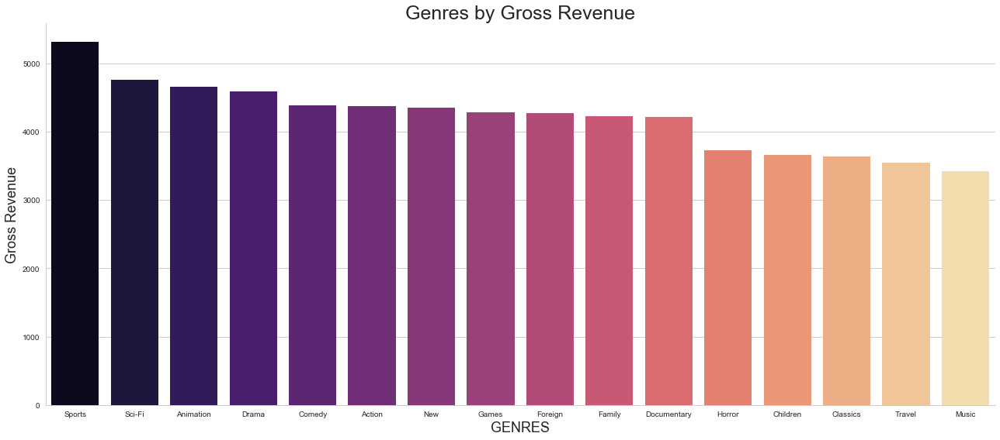

<h3>Project Title: SQL Fundaments & EDA</h3>

Project Objective: In this project, the goal was to understand basic sql queries
and explore the data in python using sql alchemy. 

Tools Used: 
<ul>
<li>Mysql</li>
<li>Jupyter notebook</li>
<li> Tableau</li>
</ul>

libraries used:
<ul>
<li>sqlalchemy </li>
<li>pandas </li>
<li>numpy </li>
<li>seaborn </li>
<li>matplotlib</li>
<li>pymysql</li>
</ul>

<h3>Plots and Findings</h3>

Top five Genres by Gross Revenue

Genres by Gross Revenue

Total Count of Movies by Genres

Total Revenue by Store

Top 10 most rented Movies

Average Film Duration by GENRES

Top 15 Geo-Locations for Customers Based on Count of Sales

<h3><u>Insights</u></h3> 

A few insights from the skill database are the following:

<ul>
<li>The top three genes by gross revenue are Sports, Sci-Fi, and Animation, respectively.</li> 

<li>There are two rental stores for this database. Revenue for Store 1 and Store 2 is approximately 33.4K and 33.9K, respectively.</li> 

<li>The top most rented move is Ridgemont Submarine.</li> 

<li>When looking at average film rating by genre, you see that PG-13 movies on average are longer in this database.</li>  

<li>Most of the customers for both stores come from India, China, and United States making up 10.02%, 8.85%, and 6.01% of sells based on customer purchases.</li> 
</ul>

<h3>More Insights into this data are located in  SQL_WORK.sql file</h3>

